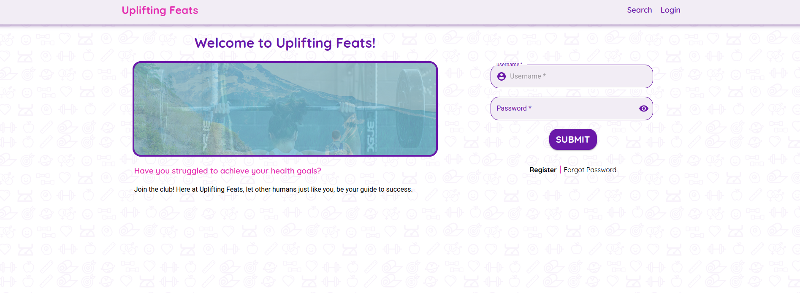
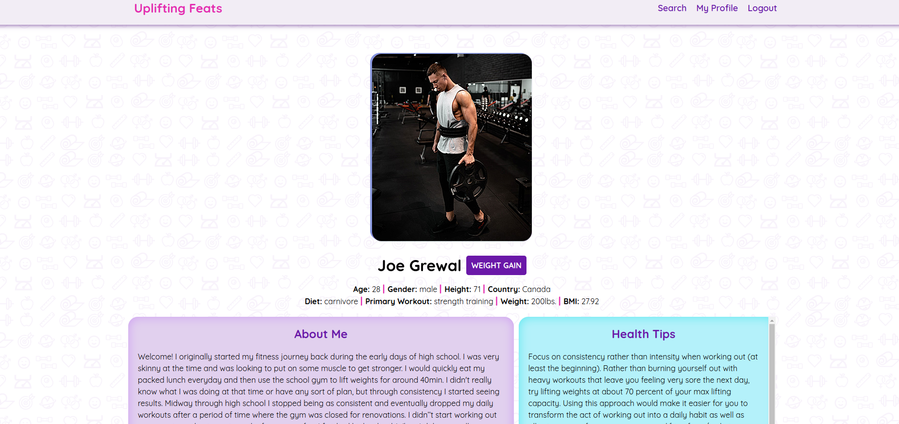
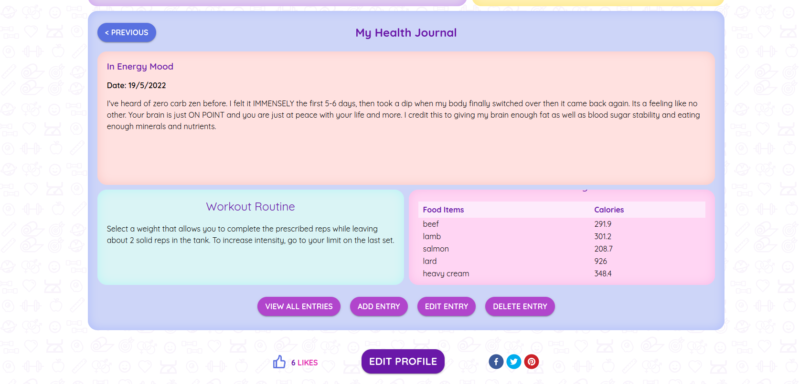
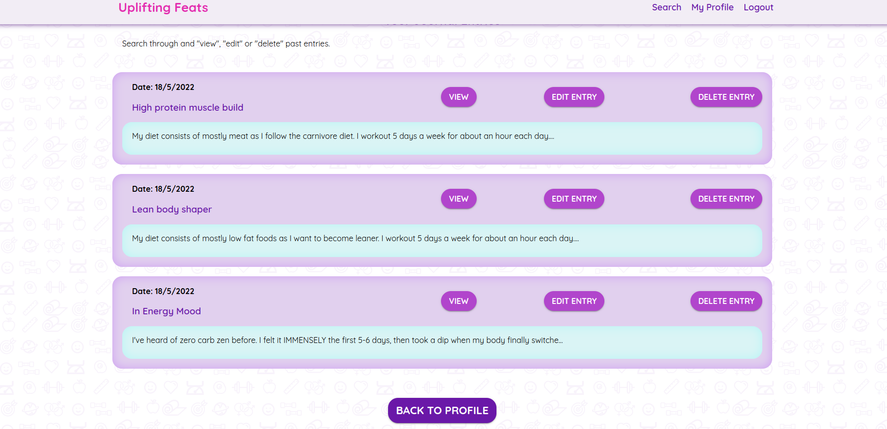
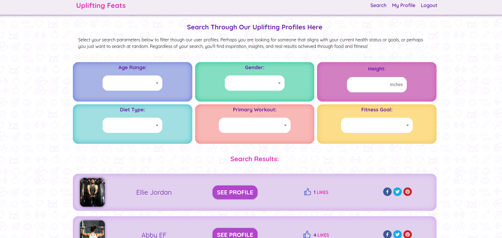

## Final Project - Lighthouse Labs

# Uplifting Feats

Thinking of taking the fitness road but feeling demotivated? Do not worry, you are not alone.

We have built an application that connects you with other people who feels the same way as you are before. Get inspiration from users who's been there done that.

Our full stack app allow users to post their own success stories to help others achieve their own fitness goals as we all know there isn’t any one solution that works for everyone.

Share their fitness stories to also help others, share yours as well.

Be inspired! Be inspirational! Uplifting feats!

### Our Stack

- PostgreSQL
- Express
- React
- Node

## Getting Started

### Client and Server

#### Dependencies

`npm install`

#### To Run The App

`npm start`

#### To Reset Server Database

`npm run db:reset`

# Final Product

